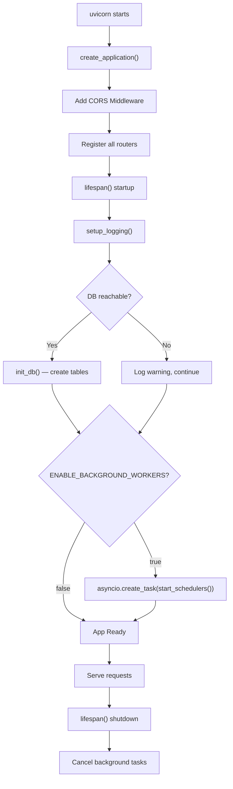
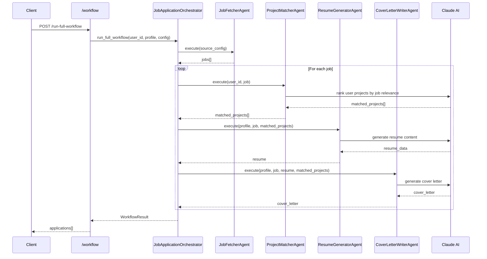
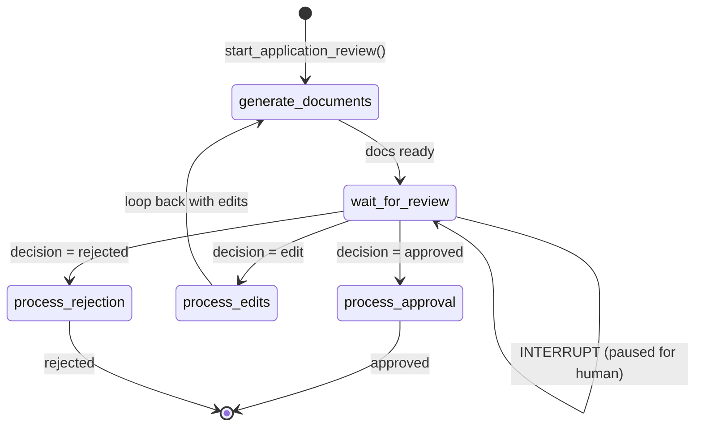
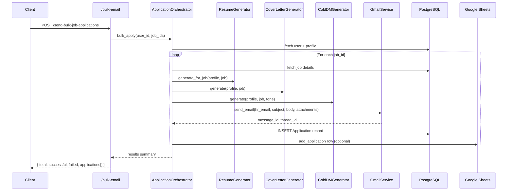
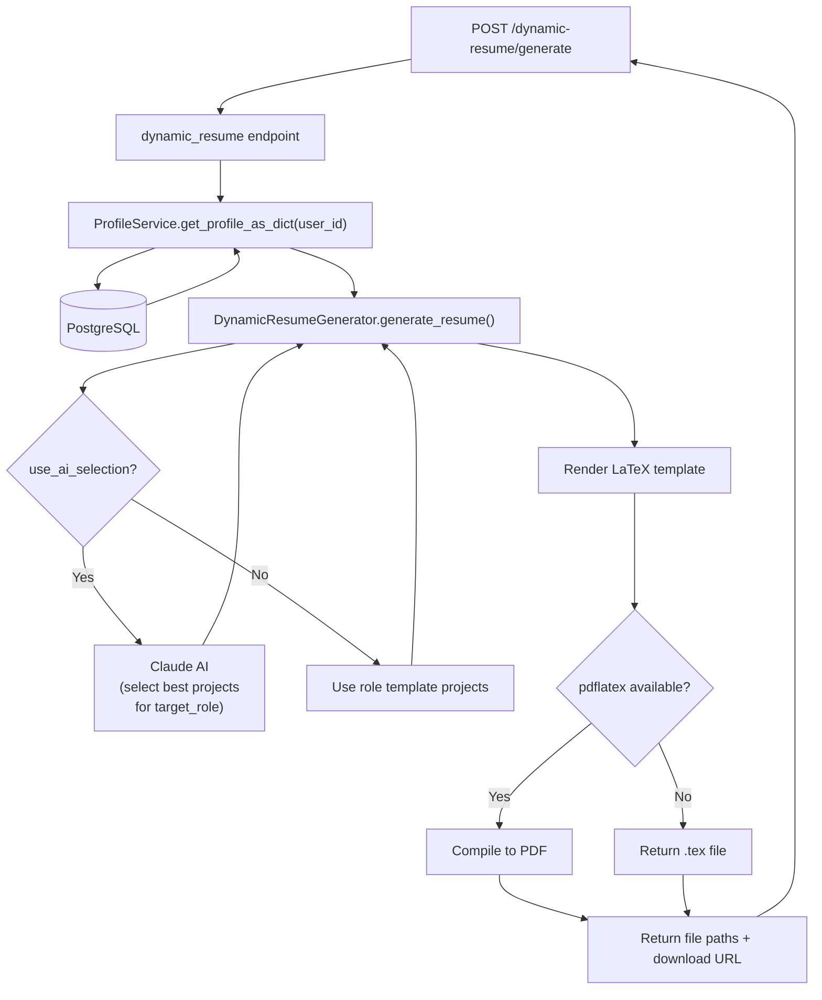
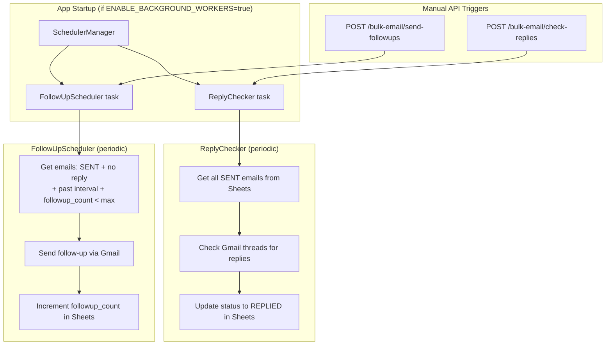
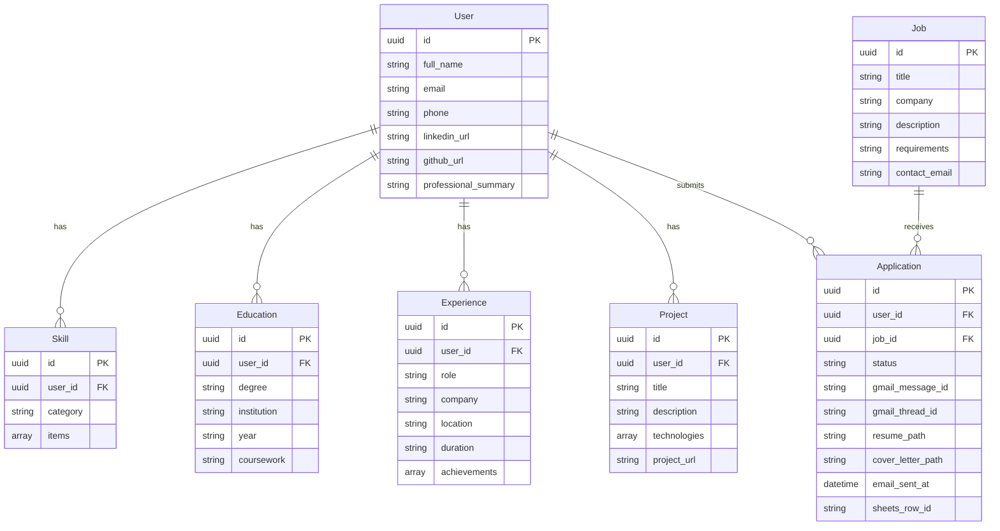
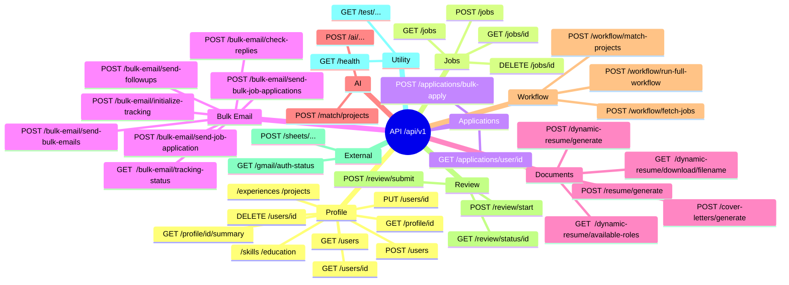

# ApplyBot — System Design

## 1. High-Level Architecture

```mermaid
graph TD
    Client["Client / API Consumer"]

    subgraph FastAPI["FastAPI Application (main.py)"]
        Router["API Router (api/v1/api.py)"]
        MW["CORS Middleware"]
    end

    subgraph Endpoints["API Endpoints (/api/v1/)"]
        EP_USER["users / profile / skills\neducation / experiences / projects"]
        EP_JOB["jobs"]
        EP_APP["applications / bulk-email"]
        EP_DOC["resume / cover-letters\ndynamic-resume / ai"]
        EP_WF["workflow / review"]
        EP_EXT["gmail / sheets / health"]
    end

    subgraph Services["Service Layer"]
        UserSvc["UserService"]
        ProfileSvc["ProfileService"]
        ProjectSvc["ProjectService"]
        ResumeGen["ResumeGenerator"]
        CoverLetterGen["CoverLetterGenerator"]
        ColdDMGen["ColdDMGenerator"]
        BulkEmailSvc["BulkEmailService"]
        EmailTrackerSvc["EmailTrackerService"]
        JobAppSvc["JobApplicationService"]
        AISvc["AIService"]
        DynResumeSvc["DynamicResumeGenerator"]
    end

    subgraph Orchestrators["Orchestrators"]
        AppOrch["ApplicationOrchestrator"]
        JobAppOrch["JobApplicationOrchestrator"]
        ReviewWF["HumanReviewWorkflow (LangGraph)"]
    end

    subgraph Agents["AI Agents"]
        JobFetcher["JobFetcherAgent"]
        ProjMatcher["ProjectMatcherAgent"]
        ResumeAgent["ResumeGeneratorAgent"]
        CLAgent["CoverLetterWriterAgent"]
    end

    subgraph Workers["Background Workers"]
        ReplyChecker["ReplyChecker"]
        FollowUpSched["FollowUpScheduler"]
        SchedMgr["SchedulerManager"]
    end

    subgraph External["External Services"]
        GmailAPI["Gmail API"]
        SheetsAPI["Google Sheets API"]
        ClaudeAI["Claude AI (Anthropic)"]
    end

    subgraph DB["Database (PostgreSQL / Supabase)"]
        Models["User / Skill / Education\nExperience / Project / Job / Application"]
    end

    Client --> MW --> Router --> Endpoints
    EP_USER --> UserSvc & ProfileSvc & ProjectSvc
    EP_APP --> BulkEmailSvc & JobAppSvc & AppOrch
    EP_DOC --> ResumeGen & CoverLetterGen & DynResumeSvc & AISvc
    EP_WF --> JobAppOrch & ReviewWF
    EP_EXT --> GmailAPI & SheetsAPI

    JobAppOrch --> JobFetcher & ProjMatcher & ResumeAgent & CLAgent
    ReviewWF --> ResumeAgent & CLAgent
    AppOrch --> ResumeGen & CoverLetterGen & ColdDMGen

    BulkEmailSvc --> GmailAPI & EmailTrackerSvc
    EmailTrackerSvc --> SheetsAPI
    JobAppSvc --> GmailAPI & SheetsAPI & AISvc

    AISvc & DynResumeSvc & ProjMatcher & ResumeAgent & CLAgent --> ClaudeAI

    UserSvc & ProfileSvc & ProjectSvc & AppOrch --> Models
    SchedMgr --> ReplyChecker & FollowUpSched
    ReplyChecker & FollowUpSched --> GmailAPI & SheetsAPI
```

---

## 2. Application Startup Flow

---

## 3. Core Application Workflow (Automated Pipeline)

---

## 4. Human-in-the-Loop Review Flow (LangGraph)

---

## 5. Bulk Job Application Flow

---

## 6. Dynamic Resume Generation Flow

---

## 7. Email Tracking & Follow-up Workers

---

## 8. Database Models

---

## 9. API Endpoint Map

